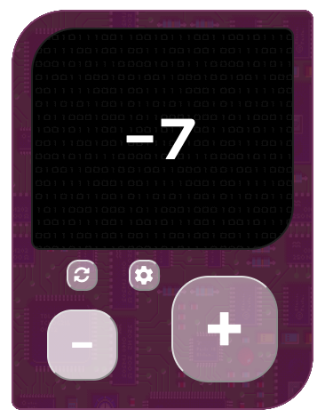

  
  <!-- PROJECT LOGO -->
  

  

    A counter that looks like an old gaming console.
     
    <a href="https://github.com/saracairo/counter"><strong>Explore the docs »</strong></a>
     
     
    <a href="https://retr0counter.netlify.app/">View Demo</a>
    ·
    <a href="https://github.com/saracairo/counter/issues">Report Bug</a>
  

  
  [![Stargazers][stars-shield]][stars-url]
  [![Issues][issues-shield]][issues-url]
  [![License][license-shield]][license-url]
  [![LinkedIn][linkedin-shield]][linkedin-url]  
  

 

<!-- TABLE OF CONTENTS -->

  
Table of Contents

  <ol>
    <li><a href="#about-the-project">About The Project</a></li>
    <li><a href="#built-with">Built With</a></li>
    <li><a href="#usage">Usage</a></li>
    <li><a href="#license">License</a></li>
    <li><a href="#contact">Contact</a></li>
  </ol>

 

## About the Project

A simple counter app I built for practice as a student, shaped like a retrogaming console.

 
 

## Built with
[![HTML][html-shield]][html-link]
[![CSS][css-shield]][css-link]
[![JavaScript][js-shield]][js-link]

 
 

## Usage
Some examples of how this app can be used.  
 - Basic functions: _increment_, _decriment_ and _reset_ the counter.  
  
 
   
 
  - Additional function: _choose the color_ you like for the console.
  
 

 
 

## License

Distributed under the GNU General Public License 3. See `LICENSE.txt` for more information.

 
 

## Contacts
Sara Cairo - https://saracairo.github.io/contacts/

<!-- MARKDOWN LINKS & IMAGES -->
[stars-shield]: https://img.shields.io/github/stars/saracairo/counter.svg?style=for-the-badge
[stars-url]: https://github.com/saracairo/counter/stargazers
[issues-shield]: https://img.shields.io/github/issues/saracairo/counter.svg?style=for-the-badge
[issues-url]: https://github.com/saracairo/counter/issues
[license-shield]: https://img.shields.io/badge/License-GPLv3-red.svg?style=for-the-badge
[license-url]: https://www.gnu.org/licenses/gpl-3.0
[linkedin-shield]: https://img.shields.io/badge/-LinkedIn-black.svg?style=for-the-badge&logo=linkedin&colorB=555
[linkedin-url]: https://www.linkedin.com/in/sara-cairo/
[html-shield]:  https://img.shields.io/badge/HTML5-E34F26?style=for-the-badge&logo=html5&logoColor=white
[html-link]: https://www.internetingishard.com/html-and-css/basic-web-pages/
[css-shield]: https://img.shields.io/badge/CSS3-1572B6?style=for-the-badge&logo=css3&logoColor=white
[css-link]: https://www.internetingishard.com/html-and-css/hello-css/
[js-shield]: https://img.shields.io/badge/JavaScript-323330?style=for-the-badge&logo=javascript&logoColor=F7DF1E
[js-link]: https://javascript.info/